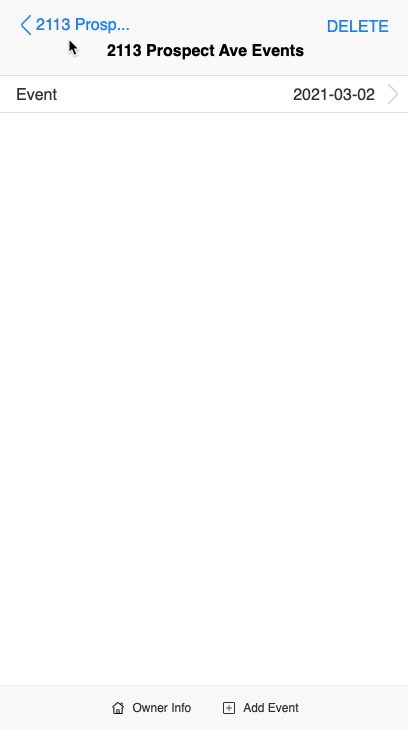

### 05/05/2021
See what's wrong with the events sync, they're not syncing up

### 03/01/2021
*He stared at his editor, there was only silence*

This will be pretty straight forward, pull down the db schema relationships, build some spreadsheet and dump it, maybe it has pages.

- [ ] Node spreadsheet export
    - [ ] server side
        - [ ] examine db schema
            - [ ] populate with old mock data
        - [ ] write queries to fetch data
        - [ ] generate spreadsheet from some library
        - [ ] add some new api route
        - [ ] dump spreadsheet
    - [ ] mobile
        - [ ] add UI update to gear/put full export option(local mobile would be different)
        - [ ] test it

- [ ] add fix to stop first letter caps in username input
    - not a problem in Chrome

Hmm the new event is not in modify mode by default, I think I remember this bug.
- [ ] No way to unset date once picked in the date picker that pops up
https://stackoverflow.com/questions/36977256/ios-safari-clear-input-type-date

- [ ] Delete event got stuck?
Man that's nasty the UI doesn't clear, just stock in props

- [ ] Also picking a date doesn't make it go away weird

- [ ] Type of property/vacant property, land bank property missing check boxes
    - looks fine in Chrome probably a Safari thing

- [ ] event didn't sync/make it back down
    - ugh... this works in Chrome
    see data here:
    

- [ ] resetting when not in home can cause problems eg. need to be at root/no real routes

Will need to primarily test Safari workflow(manually no unit tests or visual regression implemented)

Something weird happened maybe event deleted still had remnant data, yeah I still see it in events hmm

Sync is failing wonder if it's max data upload issue, won't touch this for now need to stop daemon/stop service/run code on server side and watch logs... lots of problems seems like... sucks PWA may have been a waste of time.

I'll make the RN version/deal with app store fees/app release

Yeah... I'll fix all of this.